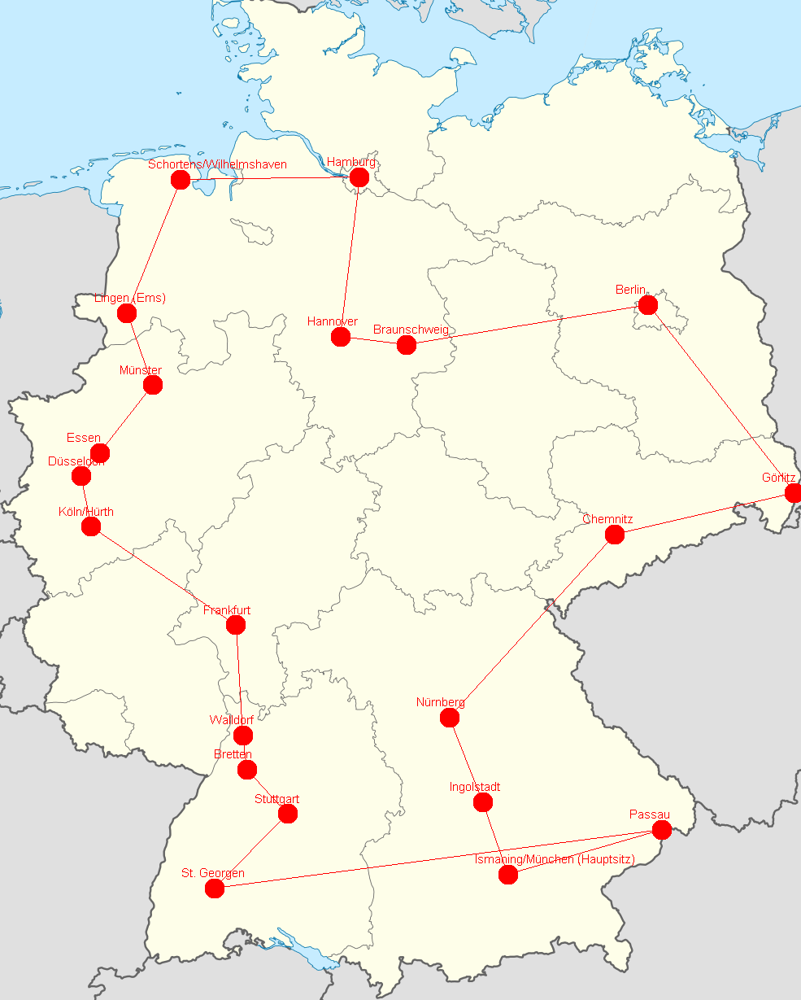
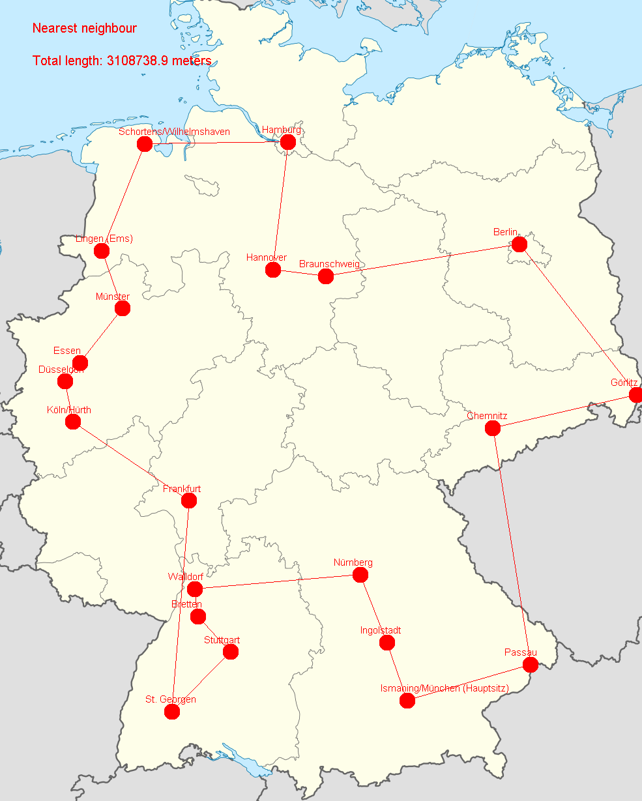

# Anleitung
Um das Programm auszuführen, können die Dateien als Maven-Projekt in Intelij importiert werden.
Anschließend müssen die Abhängigkeiten, welche in der _pom.xml_ aufgelistet sind, installiert werden. 
Nachdem die Abhängigkeiten aufgelöst sind, kann das Programm ausgeführt werden. Dafür klicken Sie auf 
den "build"-Button oben rechts in der IDE. 
Anschließend führen Sie das Programm aus in dem Sie in dem nebenstehenden Kontextmenü eine Kopie des
Templates "Applikation" erstellen. Dann tragen Sie in "working directory" und "Use classpath of module"
das Wurzelverzeichnis ein. Um das Programm nun zu starten, klicken Sie auf den Butten mit den
grünen Pfeil. 

## Distanzen zwischen den msg-Standorten 
Die Distanzen zwischen den Standorten wurde mithilfe des Service "Open Service Routing Machine" berechnet. 
Da der Service sehr unzuverlässig läuft, wurde dazu das Docker Image verwendet.

Falls Sie die Distanzen neu berechnen wollen, können Sie mit den folgenden Befehlen eine lokale Dockerinstanze des Services starten. 
Zum Starten müssen einige Befehle ausgeführt werden, welche einige Zeit (ca. 40 Minuten) in Anspruch nimmt. 
In dem Ordner data muss sich das aktuelle Open Street Map Abbild von Deutschland befinden. Dieses kann beispielsweise [hier](http://download.geofabrik.de/europe/germany) heruntergeladen werden. 
Zunächst müssen die Daten extrahiert werden.

`docker run -t -v "${PWD}\data:/data" osrm/osrm-backend osrm-extract -p /opt/car.lua /data/germany-latest.osm.pbf`

Anschließend partizioniert und angepasst werden.

`docker run -t -v "${PWD}\data:/data" osrm/osrm-backend osrm-partition /data/germany-latest.osrm `

`docker run -t -v "${PWD}\data:/data" osrm/osrm-backend osrm-customize /data/germany-latest.osrm `

Im Anschluss kann der Service mit dem folgenden Befehl gestartet werden.

`docker run -t -i -p 5000:5000 -v "${PWD}\data:/data" osrm/osrm-backend osrm-routed --algorithm mld /data/germany-latest.osrm `

Darüber hinaus muss der Methode _tsp.solveTsp_  in der Datei _Main.java_ **true** übergeben werden.

## Algorithmen
Es wurden zwei Algorithmen implementiert, welche den kürzesten Weg durch Deutschland suchen. 
Sie wurden ausgewählt, weil sie eine beinah optimale Lösung finden, aber dabei ein akzeptables Laufzeitverhalten 
aufweisen. Dies beträgt O(n2) beziehungsweise O(n3). Aufgrund der guten Laufzeit wurden beide 
Algorithmen angewendet und anschließend die Resultate verglichen. 

### Nächsten Nachbar

Der Algorithmus starte in Ismaningen und sucht von dort die nächst gelegende unbesuchte Stadt. 
Diese wird zu der Route hinzugefügt. Anschließend wird die Suche von diesem msg Standort fortgeführt.

### Gieriger Algorithmus

Diese Lösung basiert auf dem Kruskal Algorithmus. 
Die Routen zwischen den Städten werden nach der Größe sortiert. Zunächst wird dir kürzeste Strecke zu der 
Route hinzugefügt. Anschließend wird eine Strecke zu der Tour hinzugefügt, wenn sie zwei Kriterien erfüllt.
Zum einen darf ein Standort nicht mehr als zwei Verbindungen haben. Zum anderen darf der Graph nach dem Einfügen
der Kante keinen Kreis enthalten, außer es wurden alle Städte verbunden. 

## Resultat
Jeder der beiden Algorithmen hat eine Route gefunden. Dabei findet der gierige Algorithmus eine Route,
welche 4 Kilometer kürzer ist. Beide Routen sind auf den folgenden beiden Bildern dargestellt. 

Es ist zu beachten, dass die Städte auf den Bildern per Luftlinie verbunden, auch wenn die 
Berechnung auf dem deutschen Autobahnnetz basiert. 
